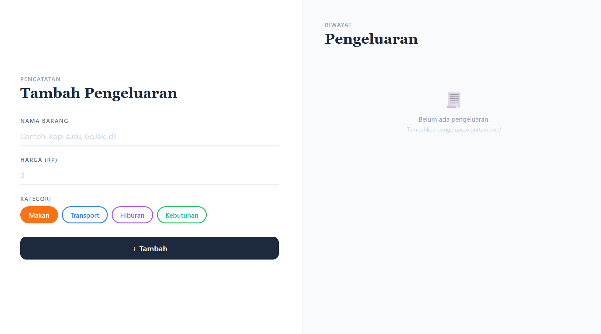
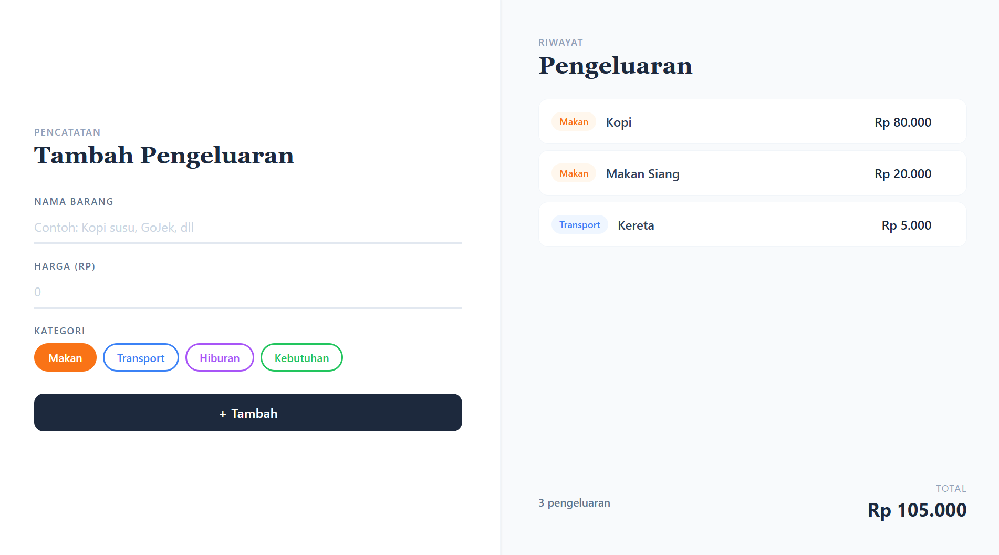

# 💸 Expense Tracker

A clean and simple expense tracking app to record and manage daily spending — built with React and TypeScript.

🔗 **Live Demo**: https://expenses-tracker-visual.vercel.app/

---

## ✨ Features

- Add expenses with name, amount, and category
- Delete expenses
- Auto-calculated total spending
- Category badges: Makan, Transport, Hiburan, Kebutuhan
- Empty state handling
- Form validation — prevents empty or zero-value submissions
- Responsive layout (desktop & mobile)

---

## 🛠 Tech Stack

- **React** — UI library
- **TypeScript** — static typing
- **Vite** — build tool
- **Tailwind CSS** — styling
- **useReducer** — state management

---

## 📁 Project Structure

```
src/
├── components/
│   ├── ExpenseForm.tsx
│   ├── ExpenseItem.tsx
│   └── ExpenseList.tsx
├── reducer/
│   └── expenseReducer.ts
├── types/
│   └── expense.ts
├── App.tsx
└── main.tsx
```

---

## 🚀 Getting Started

```bash
# Clone the repo
git clone https://github.com/ranzxx/expenses-tracker.git

# Install dependencies
npm install

# Run dev server
npm run dev
```

---

## 📸 Screenshot




---

## 👤 Author

**ranzxx** — [github.com/ranzxx](https://github.com/ranzxx)